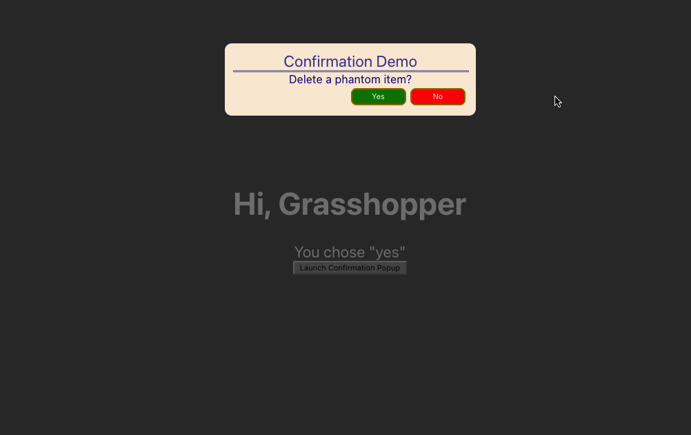

# Confirmation Dialog Implemented as Custom React Hook
This React project demonstrates wrapping a confirmation dialog in a custom 
hook. This facilitates reusing dialog boilerplate across a project, without involving 
extra code duplication. 

The motivation emerged when we needed confirmation popups across varied components.
Each had distinct wording, but shared the same format. We found we were copy-pasting mostly identical code,
but with distinct placement and handlers. 

A custom hook wrapped our modal into a simplified interface,
while allowing the dialog component to be included with unrelated components. The source code is simple. It 
uses styled components. That with JSX, can wrap a component into a single module. Refer to the `components` and `hooks` 
directories for the modal and the hook code, respectively.

## Installation

### Verify Pre-reqs:

+ eslint
+ yarn
+ node
+ (if we missed one, contact us )

### Clone and Install
+ git clone ...
+ `yarn install`

## Run

`yarn start` opens the demo in the default browser.

This screenshot is taken after replying "Yes" to the confirmation dialog and then popping it again by clicking 
the button at the bottom of the panel.

------------
# Reference

We based the custom hook upon a section presented inMedium article:
https://itnext.io/simple-tips-for-writing-clean-react-components-c3facbf6680e 

------------
This project was bootstrapped with [Create React App](https://github.com/facebook/create-react-app).

## Available Scripts

In the project directory, you can run:

### `yarn start`

Runs the app in the development mode.\
Open [http://localhost:3000](http://localhost:3000) to view it in the browser.

The page will reload if you make edits.\
You will also see any lint errors in the console.

### `yarn test`

Launches the test runner in the interactive watch mode.\
See the section about [running tests](https://facebook.github.io/create-react-app/docs/running-tests) for more information.

### `yarn build`

Builds the app for production to the `build` folder.\
It correctly bundles React in production mode and optimizes the build for the best performance.

The build is minified; the filenames include the hashes.\
Your app is ready to be deployed!

See the section about [deployment](https://facebook.github.io/create-react-app/docs/deployment) for more information.
:qgit 